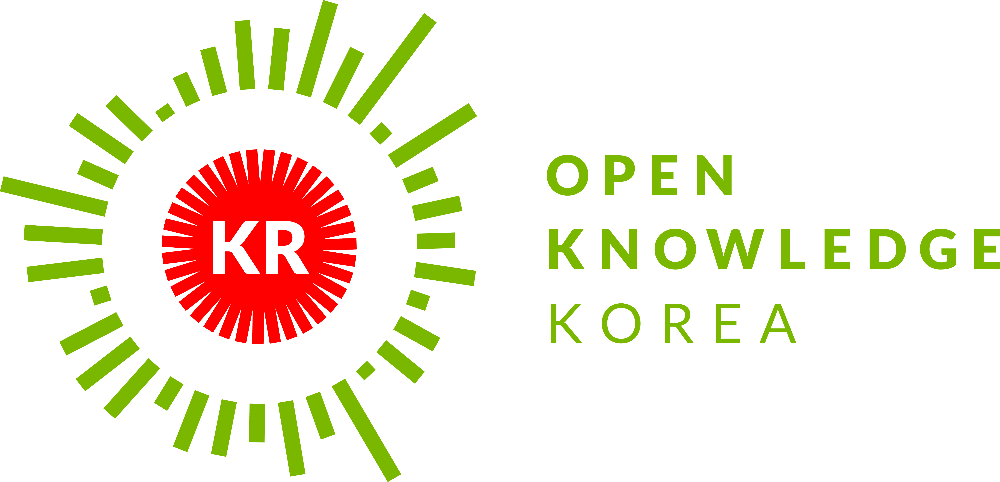
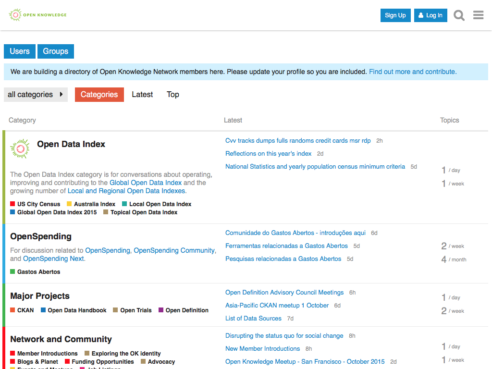

<aside class="notes">This page describes the agenda for the Open Knowledge Korea Meetup in Seoul on October 8, 2015.</aside>

<!-- .slide: data-state="title" data-background="#F0F0F0" class="center" -->
# Open Knowledge Korea Meetup #1
Presented by  
**James G. Boram Kim**

## About Open Knowledge
*formerly known as Open Knowledge Foundation*
> &ldquo;Open Knowledge is a worldwide non-profit <strong class="highlight">network of people passionate about openness</strong>, using advocacy, technology and training to unlock information and enable people to work with it to create and share knowledge.&rdquo;

<!-- .slide: class="center" style="text-align: center;" -->

### Values of Open Knowledge
> &ldquo;We try to be pragmatic in our work; not everyone will believe equally in all parts of our vision, but the open knowledge network is a 'big tent' where participants are <strong class="highlight">welcome regardless of their specific motivations</strong>.  We are **enthusiastic**, **collaborative** and **inclusive**. We are **engaged**, not complacent.  We are not just thinkers - we are **doers**, making things happen, building, investigating, training and learning, writing and analysing.&rdquo;

<!-- .slide: class="center" style="text-align: center;" -->
<ul>
  <li class="fragment highlight-current-green"><strong>Open Knowledge</strong> <aside class="notes">All our activities are connected to open knowledge.</aside></li>
  <li class="fragment highlight-current-green"><strong>Respect &amp; Tolerance</strong> <aside class="notes"> Respect and tolerance are pre-conditions for all our work, and essential to working as a collaborative community.</aside></li>
  <li class="fragment highlight-current-green"><strong>Collaboration NOT Control</strong> <aside class="notes">To achieve our vision we cannot work alone.</aside></li>
  <li class="fragment highlight-current-green"><strong>Pragmatic NOT Fanatic</strong> <aside class="notes">We are strong believers in “open” but our commitment is animated by a desire to make change, not to establish our moral superiority.</aside></li>
  <li class="fragment highlight-current-green"><strong>Making &amp; Talking</strong> <aside class="notes">We value making and talking equally and thrive on their creative tension.</aside></li>
  <li class="fragment highlight-current-green"><strong>Change-making</strong> <aside class="notes">We want to see change in the world and we want to make this happen today not tomorrow.</aside></li>
</ul>

## About Open Knowledge (South) Korea
*formerly known as Open Knowledge Foundation Korea*

* Originally proposed &amp; founded by Haklae Kim in 2012
* Based on the work of the Web Science Workgroup Korea
* Though not as active as before during the last couple of years

## The Foundations of the Foundation
*maybe out of date, but still worth a look*

  
  <ul class="left-float">
    <li class="fragment" data-fragment-index="1">
      <strong>Open Definition (열린 정의)</strong>
      
    </li>
    <li class="fragment" data-fragment-index="2">
      <strong>KOGL (공공누리)</strong>
      
    </li>
    <li class="fragment" data-fragment-index="3">
      <strong>Open Data Handbook</strong>
    </li>
    <li class="fragment" data-fragment-index="4">
      <strong>Open Knowledge Korea</strong>  
      
    </li>
    <li class="fragment" data-fragment-index="5">
      <strong>Open Data Index</strong>
      
    </li>
    <li class="fragment" data-fragment-index="6">
      <strong>Where Does My Money Go?</strong>
      
    </li>
    <li class="fragment" data-fragment-index="7">
      Korea Datahub (?)
      
    </li>
  </ul>

## Open Definition (열린 정의)

> &ldquo;Knowledge is open if anyone is free to access, use, modify, and share it — subject, at most, to measures that preserve provenance and openness.&rdquo;

> &ldquo;출처와 개방성 유지를 위한 수단을 최대 조건으로 누구나 자유롭게 접근, 사용, 변경, 공유할 수 있을 때, 지식은 열려있다.&rdquo;

<!-- .slide: class="center" style="text-align: center;" -->

http://opendefinition.org/od/2.1/ko/

<!-- .slide: class="center" style="text-align: center;" -->

https://github.com/okkr/opendefinition/

<!-- .slide: class="center" style="text-align: center;" -->

http://opendefinition.org/licenses/

## KOGL (공공누리)

* Developed by the *South Korean government* (more precisely by the Ministry of Culture, Sports and Tourism) to allow citizens' free use of public works **without individual permission**
* Four different types of licenses in the KOGL, modeled after the Creative Commons (CC) licenses
* <strong class="highlight">KOGL Type 1</strong>, similar to CC-BY, is the only one recommened by the government to use.

<!-- .slide: class="center" style="text-align: center;" -->

http://opendefinition.org/licenses/process/

## Open Data Handbook

  
  

<!-- .slide: class="center" style="text-align: center;" -->

http://opendatahandbook.org/

<!-- .slide: class="center" style="text-align: center;" -->

http://opendatahandbook.org/glossary/

<!-- .slide: class="center" style="text-align: center;" -->

http://opendatahandbook.org/contribute/

<!-- .slide: class="center" style="text-align: center;" -->

https://github.com/okkr/opendatahandbook/

* Only _**30**_ terms left to translate out of 123 terms!
  - Maybe what we will do in the _next meetup_?
* Branches:
  - [glossary-translation](https://github.com/okkr/opendatahandbook/tree/glossary-translation)
  - [guide-translation](https://github.com/okkr/opendatahandbook/tree/guide-translation)
  - More is coming&hellip;
* Want to contribute? Just do it!
* Can't code? No problem at all!
* Need discussions? Create a new [issue](https://github.com/okkr/opendatahandbook/issues)!

## Open Knowledge Korea

**<em class="highlight">Let's revive the Open Knowledge community in Korea!</em>**

The Two of Our Values:
* **Respect &amp; Tolerance**
* **Collaboration NOT Control**

<!-- .slide: class="center" style="text-align: center;" -->

https://discuss.okfn.org/

<!-- .slide: class="center" style="text-align: center;" -->

https://discuss.okfn.org/c/local-groups/okkr

<!-- .slide: class="center" style="text-align: center;" -->

<!-- .slide: class="center" style="text-align: center;" -->
<strong class="big-text">Why Don't You Join Us?!</strong>

## Open Data Index

<!-- .slide: class="center" style="text-align: center;" -->

http://index.okfn.org/place/south-korea/

<strong class="medium-text">Census = Rolling Survey</strong>

<strong class="medium-text">Index = Resulting Report (and Leaderboard)</strong>

> &ldquo;The Index aims to provide accessible 'league table' presentation along with detailed country by country data peer-reviewed by experts.
> 
> Easy engagement from both policy-makers, researchers, activists, and data users.&rdquo;

<!-- .slide: class="center" style="text-align: center;" -->

http://global.census.okfn.org/place/kr

### Key Principles
* Real Open Data &mdash; Open Definition
* Quality rather than Quantity
* Comparability (across countries)
* (Ease of) Assessability
  - Datasets over policies (in general)
* Rankability

### Structure
* Focus on "key" datasets (15 in 2015)
* Considered additional indicators
* Allow submission by community
* But, all submissions reviewed by thematic expert reviewers to ensure quality and comparability

### Reflections
* Strict minimum criteria for some datasets
  - Yearly population census
  - 5 days weather forecast
  - Weekly water quality
* Public Availability
  - Is requesting an API key OK?
  - What if login required?
* Non-open Licenses
* Bulk Availability

### Next Step: National Census

### After this&hellip;

  

  <a href="http://www.wheredoesmymoneygo.kr/">http://www.wheredoesmymoneygo.kr/</a>

<!-- .slide: class="center" style="text-align: center;" -->

  

  <a href="https://summit.cckorea.org/">https://summit.cckorea.org/</a>

<!-- .slide: class="center" style="text-align: center;" -->
<strong class="big-text">And more&hellip;</strong>

<!-- .slide: class="center" style="text-align: center;" -->
<strong class="big-text">Let's Do It!</strong>